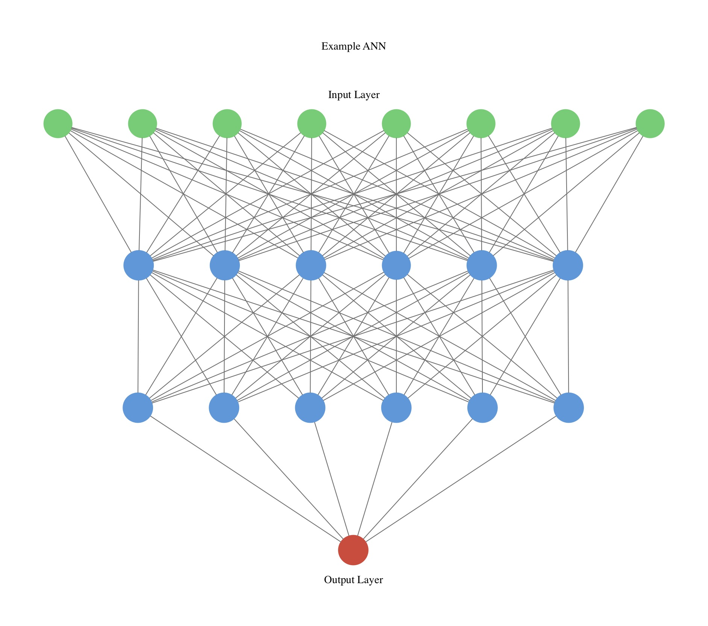

## Brief Introduction to Artificial Neural Networks

The field of Artificial Intelligence which deals with intelligence demonstrated by computer systems, has seen major growth in the last few years and many believe that this growth is due to advancements in **Artificial Neural Networks** (or ANN’s for short). ANN’s can be thought of as computational frameworks, loosely inspired by the human cognitive function and biological neural networks. 

In this post, I will provide a brief and simple introduction to ANN’s and hopefully when you finish reading this you will have a high-level understanding of how and why they are used.

### Connection to Nature: Biological Neural Networks

Neurons are the fundamental units of the brain and nervous systems. They are a specialized cell whose function is to transmit information from one part to the other. Neurons “connect” with other neurons to form networks, and communicate with each other through a process of electrochemical signaling. These neural networks act as the basis for human cognitive function and allows us to process and handle information.

An individual neuron receives information in its Dendrites (in the form of chemical signals), process it and then propagates that information at the Axon Terminals. Note that there are many different types of neurons so their structure and function can vary. If they receive the necessary amount of excitatory input, the neuron “fires” and transmits a signal through the network. 

### Delving deeper into ANN's

As its biological counterpart, ANN’s consist of a collection of processing units called artificial neurons which receive multiple inputs and have one output. These connections are weighted, which basically means that they carry a value. Each artificial neuron performs a weighted calculation on its inputs, and outputs the result of this calculation. Here is a visualization of an artificial neuron in comparison to a biological neuron.

The calculation that each neuron performs is a function of the inputs and is called the **transfer function**. The network as a whole is then able to detect patterns and perform complex computations. 

However, to be able to perform a calculation, we have to show it how: 

This can be done by providing the network with examples. This process is called **supervised learning**, where the ANN is given a set of example inputs, as well as what the correct output should be for each input. The artificial neural networks then adjust the weights and firing rules (the calculation at each unit) of artificial neurons, calculate the probability of each output and, if the input set is large enough, become experts in the task on hand. In other words they strengthen the connections that lead to success and weaken those that lead to failure. 

Artificial Neural Networks usually tackle two types of problems, **classification** problems which are all about predicting the correct label for an input, and **regression** problems which deals with computing a value.

Let’s think about a very simple ANN, a single input neuron and output neuron. A representation of it looks like this:

#### Multilayered ANN's

There are not a lot of complicated computations that can be done with this network, which is why networks are usually structured in **layers**, which are collections of artificial neurons. Multilayered neural networks are the basis of Deep Learning, an area of machine learning research (and broader family of ML methods). Multilayered ANN’s consist of an input layer (these layers get the information from the outside world), hidden layers (they are called hidden because their inputs and outputs go to other neurons)  and the output layer. 

##### Feedforward ANN's
Let’s look at a visualization for an ANN that has one input layer, one hidden layer, and one output layer. This type of ANN is called a **Feedforward Neural Network**, which basically means that connections between artificial neurons do not form cycles:

What’s so special about this and any other feed-forward neural network is that they follow the [Universal Approximation Theory](http://mcneela.github.io/machine_learning/2017/03/21/Universal-Approximation-Theorem.html), which in its simplest form states that a Feedforward neural network with at least one hidden layer is able to represent any computable function possible, if structured and trained correctly and with the appropriate transfer functions. This is fascinating to think about, even for the simplest of Feedforward ANN's.

Here is a visual representation of a multilayered ANN, with multiple hidden layers:
 

This network consists of an input layer with 8 units, two hidden layers with 6 units and an output unit. As you can see, the output of each unit is passed to all the units in the next layer, which is generally the case in feed-forward networks. 

##### Recurrent Neural Networks

Have you considered cases where Feedforward ANN’s are not the best frameworks to be used? Problems such as speech or handwriting recognition are dynamic in nature, as current outputs depend on previous knowledge (for example in a speech recognition sequence we can narrow down inappropriate outputs by having access to what was previously outputted as the next word usually depends on previous statements in coherent speech. Feedforward ANN’s have no way to store memory. They are only applicable for cases when correct outputs for each input are independent of each other and are computable based on the training set we provided it. For applications with **sequential input**,  another kind of ANN comes into play: 

**Recurrent neural networks (RNN’s)** are ANN’s that use their _"internal memory”_ to process sequential input. These networks employ feedback loops, where the output of one layer routes back to the previous layer. There are various types of RNN’s, with a very useful and powerful one being the [LSTM (Long short-term memory)](https://en.wikipedia.org/wiki/Long_short-term_memory). What’s fascinating about this architecture is that it acts it can compute anything that a Turing Machine (or any general purpose computer), using its feedback loops, even with applications that require sequential or discrete inputs.

### Future Study

I know that this was a lot of information to withhold but I hope that I was able to shed some light into these intimidating computational frameworks that are being used everywhere nowadays. Obviously you cannot expect to be an expert overnight, but fortunately the internet is the #1 resource to learn. If you want to play around with an ANN, I suggest [Tensorflow's playground](http://playground.tensorflow.org/#activation=tanh&batchSize=10&dataset=circle&regDataset=reg-plane&learningRate=0.03&regularizationRate=0&noise=0&networkShape=4,2&seed=0.47097&showTestData=false&discretize=false&percTrainData=50&x=true&y=true&xTimesY=false&xSquared=false&ySquared=false&cosX=false&sinX=false&cosY=false&sinY=false&collectStats=false&problem=classification&initZero=false&hideText=false)

### Sources

